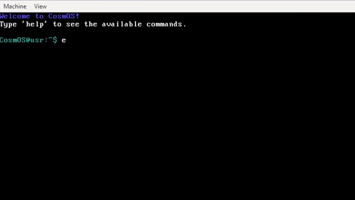

# CosmOS 

CosmoOS is a simple 32bit operating system written in C

## Demo

## Features

- Basic Screen Management
- Input/Output Handling
- Command Handling
- Keyboard Support

## Planned Features

- Basic Memory Management
- File System
- Multitasking
- Drivers (keyboard, mouse)

[🔖 Changelog](CHANGELOG.md)
